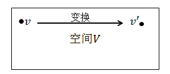

参考资料：

​	《Deep Learning with Python》François

​	《机器学习》周志华

​	《统计学习方法》李航

​	<https://www.bilibili.com/video/av6731067>  3Blue1Brown

​	<https://blog.csdn.net/myan/article/details/647511>  myan

****

本文主要回答以下问题：

1. 矩阵、向量的定义
2. 实际工作中怎么使用矩阵和向量的？
3. 矩阵是什么？为什么它具有这么广泛的应用？
4. 矩阵的乘法为何这样规定？为什么这种乘法规则能够在实践中具有如此大的功效？
5. 为什么说 $P^{-1}AP$ 得到的矩阵与 $A$ 相似？这里说的“相似”究竟是什么含义？

------

## 1. 矩阵、向量的定义及使用

向量，线性代数中对向量下的定义是：

```
是一个nx1的矩阵，由一个含有n个数字的列组成。
```

$$
 \vec v =  \left[
\begin{matrix}
v_1 \\
v_2 \\
.\\
. \\
. \\
v_n
\end{matrix}
\right] = \left[
\begin{matrix}
v_1, v_2, ..., v_n
\end{matrix}
\right]^T
$$

矩阵，线性数学教材中对矩阵下的定义是：

```
由m行n列的数字放在一起组成的数学对象。m和n相等时，又称之为方阵。
```

$$
A  = A_{m \times n} = \left[
\begin{matrix}
a_{1,1} & a_{1,2} & ... & a_{1,n} \\
a_{2,1} & a_{2,2} & ... & a_{2,n} \\
. & . & . & .\\
. & . & a_{i,j} &. \\
. & . & . & .\\
a_{m,1} & a_{m,2} & ... & a_{m,n}
\end{matrix}
\right] = \left[
\begin{matrix}
\vec a_1; \vec a_2;...;\vec a_n
\end{matrix}
\right]
$$

​	定义完矩阵和向量后，我们先看看在实际工作中是怎么应用矩阵知识的。下面借助“判断西瓜甜否”这个任务来描述。

​	任务描述为：
$$
已知某个西瓜的色泽、根蒂形状、敲声，判断该西瓜是否甜
$$
实际应用中常常将一个对象表示为一个向量，向量的每个维度表示对应的特征。如将一批西瓜数据可以表示为
$$
西瓜a =  \left[\begin{matrix}青绿 \\蜷缩 \\浊响\end{matrix}\right]，西瓜b =  \left[\begin{matrix}乌黑 \\稍蜷 \\沉闷\end{matrix}\right]，...
$$
将一批西瓜放在一起便得到了一个矩阵：
$$
西瓜特征集 =  \left[
\begin{matrix}
青绿 & 乌黑 & ... \\
蜷缩 & 稍蜷 & ... \\
浊响 & 沉闷 & ...\\
\end{matrix}
\right]
$$
以及每个西瓜的类别也可以组成一个矩阵：
$$
西瓜结果集 =  \left[\begin{matrix}甜，不甜，...\end{matrix}\right]
$$
生活中，我们完成这样一个任务是通过人为的历史经验总结，根据西瓜特征集与西瓜结果集假设出一条或多条规则，然后利用新的数据去验证这些规则，从而得到最有可能正确的判断依据。将其表示为 $f$ ，然后利用变换 $y=f(x)$ 求出结果。但是毕竟人力有穷尽，当历史经验数据增大到一定数量或特征数量及其复杂度增大时，人为总结就显得比较困难了。这时我们需要一种科学的方法来自动根据数据集“总结”出这个 $f$。

我们可以将这个过程描述为：
$$
找到这样的 f，满足：f（西瓜特征集）=西瓜结果集
$$
我们可以将所有的西瓜看作一个空间 $V$，该空间中的每个点对应每一个西瓜，每个点表示为其在每个特征上的取值组成的一个向量。再将西瓜的好坏看作另一个空间 $W$，该空间中的每个点取值为“甜”或“不甜”。且已知 $V$ 中的部分数据$X$及其对应的在 $W$中的 $Y$，如下图所示：


我们可以将目标描述为：
$$
有空间V、W，以及数据集X，Y，且X \subset V, Y \subset W, 且X和Y存在对应关系；
$$

$$
求得这样的变换f，该变换f满足   f(X)=Y
$$

如果我们求得这样的 $f$，则我们有理由认为该 $f$ 对于 $V$ 中的剩余数据点与 $W$ 中对应数据点的映射关系同样满足。

可以经过一次变换得到：


可以经过多次变换得到：


​	 通常，$f$ 的变换规则我们是确定的，最简单的一种规则是乘以一个矩阵进行线性变换
$$
f(X) = TX= Y
$$
只是其中的参数(即$T$的值)我们不确定，将参数定义为 $\theta$。本文的重点是介绍向量、矩阵，理解其思想逻辑，至于具体$\theta$ 的求解过程需要用到的概率论、信息论、决策论、微分方程及其他的线性代数知识，以后有机会再做介绍。

下面我们再来介绍上面涉及到的空间、向量、矩阵、基、变换的具体含义。

## 2. 空间

​	首先来说说**空间(space)**，这个概念是现代数学的基础之一。空间有很多种，如果去看某种空间的数学含义，大致都是：

```
存在一个集合，在这个集合上定义某某概念，然后满足某些性质
```

​	我们最熟悉的空间，毫无疑问就是我们生活在其中的（按照牛顿的绝对时空观）三维空间，从数学上说，这是一个三维的欧几里德空间。我们先看看这个空间有些什么最基本的特点：

```
1. 由无穷多的位置点组成；
2. 这些点之间存在相对的关系；
3. 空间中可以定义长度、角度；
4. 空间可以容纳运动，即从一个点到另一个点的变换。注意：此处的运动不一定是连续性的
```

从上述特征中，很明显可以看出 **空间的本质是容纳点的运动.**  再将这个概念推广到其他空间中，**事实上，不管是什么样的空间，都必须容纳或支持点在其中发生符合规则的运动（变换）**。特定的空间中都往往存在一种相对应的特定变换，如拓扑空间中有拓扑变换，线性空间中有线性变换，仿射空间中有仿射变换，其实**这些变换都只不过是对应空间中所定义的允许点运动的形式而已**。

即我们可以得出一个初步结论：

```
空间的本质是一个可以容纳运动的对象集合，变换规则规定了空间中对象的运动形式。
```

## 3. 线性空间

回到前面所得出的初步结论，在对应于我们最常用的线性空间，我们可以提出这样两个问题：

1. 线性空间集合中的对象是什么？有什么特征？
2. 如何表述线性空间中的运动？即线性变换如何表示？

		我们可以直接回答第一个问题，**线性空间中的任何一个对象（点），通过选取基和坐标的办法，都可以表示为向量的形式**。举个例子，最高次项不大于 $n$ 的多项式全体构成一个空间，也就是说，这个线性空间中的每一个对象是一个多项式：
$$
a_0x^0+a_1x^1 + ... + a_nx^n
$$
如果我们选择以 $(x^0,x^1,...,x^n)$ 作为基，那么任何一个这样的多项式都可以表示为一组 $n+1$ 维的向量，其中的每个分量 $a_i$ 是多项式 $x^{i-1}$ 的系数。如：
$$
x+x^2 
$$
可以表示为向量：
$$
(0,1,1,0,0,...,0)^T
$$
值得注意的是，基的选取有多种方法，上述选择只是其中的一种。所以说向量是很厉害的，只要我们找到了一个合适的基，用向量可以表示线性空间中的任何一个对象。

​	然后我们再来回答第二个问题。线性空间中的运动，被称为线性变换。也就是说，我们从线性空间中的一个点运动到任意的另外一个点，都可以通过一个线性变换来完成。那么线性变换如何表示呢？**有意思的是，在线性空间中，当我们选定一组基后，不仅可以用一个向量来描述空间中的任意一个对象，而且可以用矩阵来描述该线性空间中的任意一个运动（变换）。而使某个对象发生对应运动的方法，就是用代表那个线性变换的矩阵，乘以代表那个对象的向量。**即：
$$
v' = A_{m \times n}v
$$
比如，我们将直角坐标系中的点 $(2,3)^T$ 变换为 $(1,1)^T$，可以通过下面这个过程完成(具体计算过程我们可以暂时不理会，后边会提到，现在只需知道这样一种计算规则即可)：
$$
\left[
\begin{matrix}
0 & 1/3\\
1/2 & 0
\end{matrix}
\right] \times (2,3)^T = \left[
\begin{matrix}
0 \times 2 + 1/3 \times3\\
1/2 \times 2 + 0 \times 3
\end{matrix}
\right] = (1,1)^T
$$
即在线性空间中，我们选定一组基后，用向量刻画对象，矩阵刻画对象运动，矩阵与向量的乘法施加运动。

我们可以得到进一步的结论：

```
矩阵的本质是线性空间中线性运动的描述
```

## 4. 变换

​	前面提到，矩阵的本质是线性空间中运动的描述。不过此处的”运动”不是连续性的运动，而是瞬间发生的变化。比如这个时刻在A点，经过一个“运动”，一下子就“跃迁”到了B点，其中不需要经过任何一个其它的点。而“跃迁”是一个物理概念，我们需要将其抽象为一个数学概念——**变换**。所以我们可以得到更进一步的结论：

```
矩阵是线性空间中线性变换的描述
```

教材中提到，在线性空间 $V$ 中的一个线性变换 $T$ ，当我们选定一组基后，该变换  $T$ 就可以表示为一个矩阵。线性变换的定义其实是很简单的。

​	设有一种变换 $T$，使得对于线性空间 $V$ 中的任何两个不相同对象 $x$ 和 $y$ , 有下列式子成立：
$$
T(ax+by) = aT(x) + bT(y)
$$
那么就可以将变换 $T$ 称为线性变换。

​	但是这个概念太抽象了，下面我们再来详细介绍什么是基，什么叫选定一组基，以及线性变换究竟是一种什么样的变换。

​	变换，是从空间的一个点跃迁到另一个点，**而线性变换，就是从一个线性空间 $V$ 的某一个点跃迁到另一个线性空间 $W$ 的另一个点的运动。也就是说，一个点不仅可以变换到同一个线性空间中的另一个点，而且还可以变换到另一个线性空间中的一个点去。**不管怎么变换，只要变换前后都是线性空间中的对象，那么这个变换就一定是线性变换，就一定可以用一个矩阵来描述。


## 5. 矩阵的理解

​	我们下面先讨论一种特殊的线性变换：**在同一个线性空间之内的线性变换。**也就是说，变换前后的向量都在同一个空间中。



完成这种线性变换的矩阵需要是一个方阵，即矩阵的行数与列数相同：
$$
A_{n \times n}
$$
接着说，什么是基呢？此处我们只要**把基看作是线性空间中的坐标系就可以了**。注意是坐标系，不是坐标值。这样一来，“选定一组基” 就是在线性空间中选定一个坐标系。然后我们可以对矩阵的理解更进一步：

```
矩阵是线性空间中线性变换的一个描述。在一个线性空间中，只要我们选定一组基，那么对于任何一个线性变换，都能够用一个确定的矩阵来加以描述。
```

​	理解这句话的关键，在于把握**“线性变换”**和**“线性变换的一个描述”**区分开。一个是对象本身，一个是对象的描述。举个例子，有一个美女，我们打算给她拍一张照片，只要给相机选定了一个镜头位置，就可以得到这个美女的一张照片。这个照片就可以看成是这位美女的一个描述，但是这只是一个片面的描述，因为换一个镜头位置再拍一张照片，我们就能得到一张不同的照片，这也是这位美女的另一个片面描述。所有这样照出来的照片都是这同一个美女的描述，但是又都不是这位美女本身。

​	同样的，对于一个线性变换，只要选定一组基，那么就可以找到一个矩阵来描述这个线性变换。换一组基，就能够得到另一个不同的矩阵。所有的这些矩阵都是这同一个线性变换的描述，但是又都不是线性变换本身。

## 6. 相似矩阵

​	照前面的描述，那么问题来了，如果我们得到了两张美女的照片，怎么知道这两张照片上的是同一个人呢？同样的，我们得到了两个矩阵，怎么判断这两个矩阵描述的是同一个线性变换呢？好在，我们可以找到同一个线性变换的矩阵描述们的一个性质，那就是：

​	若矩阵 $A$ 和矩阵 $B$ 是同一个线性变换的两个不同的描述（之所以不同，是因为我们选定了不同的基，也就是选定了不同的坐标系），则一定能够找到一个非奇异矩阵(此处先不管这个概念，知道其存在就可以了) $P$，使得 $A,B$ 之间满足：
$$
A = P^{-1}BP
$$
在线性代数中，**这就是相似矩阵的定义**。是的，**所谓相似矩阵，就是同一个线性变换的不同的描述矩阵**。按照这个定义，同一个美女的不同角度的照片也可以成为相似照片. ;-)

​	当然，同一个线性变换的不同矩阵描述，从实际运算性质来看并不是不分好坏的。有些描述矩阵就比其它的描述矩阵性质好得多。这很容易理解，同一个女生的照片也有美丑之分嘛。所以矩阵的相似变换可以把一个“丑”的矩阵变成一个“美”的矩阵，而同时保证这两个矩阵都描述了同一个线性变换。

​	这样一来，矩阵作为线性变换描述的一面，基本上已经说清楚了。但是，事情远远没有那么简单，线性代数还有比这更奇妙的性质，即：

```
矩阵不仅可以作为线性变换的描述，而且可以作为一组基的描述。而作为变换的矩阵，不但可以把线性空间中的一个点给变换到线性空间的另一个点去，而且也能够把线性空间中的一个坐标系（基）变换到另一个坐标系（基）去。且变换点与变换坐标系，具有异曲同工的效果。
```


## 7 基、向量、矩阵的再理解

我们先总结一下上面得到的主要结论：

```
1. 首先有空间，空间可以容纳对象运动。一种空间对应一类对象集合。
2. 有一种空间叫做线性空间，线性空间是容纳向量运动的。
3. 向量的运动是瞬时的，因此也被称为变换。
4. 矩阵是线性空间中运动（变换）的描述。
5. 矩阵与向量相乘，就是实施运动（变换）的过程。
5. 同一个变换，在不同的坐标系下表现为不同的矩阵，但是它们的本质是一样的。
```

有了这些认识，我们就可以回答文章开头提出的问题了。首先，我们知道了线性空间中的基本对象是向量，而一个 $n$ 维向量是这样表示的：
$$
\vec v =  \left[
\begin{matrix}
v_1 \\
v_2 \\
.\\
. \\
. \\
v_n
\end{matrix}
\right] = \left[
\begin{matrix}
v_1, v_2, ..., v_n
\end{matrix}
\right]^T
$$
矩阵呢，是这样表示的：
$$
A  = A_{m \times n} = \left[
\begin{matrix}
a_{1,1} & a_{1,2} & ... & a_{1,n} \\
a_{2,1} & a_{2,2} & ... & a_{2,n} \\
. & . & . & .\\
. & . & a_{i,j} &. \\
. & . & . & .\\
a_{m,1} & a_{m,2} & ... & a_{m,n}
\end{matrix}
\right]
$$
很明显，矩阵是由一组向量组成的。特别的，$n$ 维线性空间里的方阵是由 $n$ 个 $n$ 维向量组成的。

​	如果一组向量彼此线性无关，那么它们就可以成为度量这个线性空间的一组基，从而事实上成为一个坐标体系。其中每一个向量都躺在一根坐标系上，并且成为那根坐标轴上的基本度量单位（长度1）（可以对比直角坐标系理解）。

​	现在，我们到了关键的一步，看上去矩阵就是由一组向量组成的，而且如果组成这个矩阵的那一组向量也线性无关的话，那么这个矩阵也可以成为度量线性空间的一个坐标系。即：

```
矩阵描述了一个坐标系
```

而前面说到，“矩阵描述了一个运动（变换）”, 这儿是不是冲突了呢？其实没有，那是因为：

```
运动等价于坐标系变换
```

准确的说，应该是：

```
对象的变换等价于坐标系的变换
```

或者：

```
固定坐标系下的一个对象的变换，等价于固定对象所处的坐标系的变换
```

说白了，就是：

```
运动是相对的
```

举个例子，在平面直角坐标系中，我们要把点 $A(1,1)$ 变换到点 $B(3,3)$，可以有两种方法。第一，坐标系不动，点动，把点 $A$ 移动到点 $B$ 去。第二，点不动，坐标系动，让 $x,y$ 轴的度量（单位向量）变为原来的 $1/3$，这样点还是那个点，可是坐标就变成了 $(3,3)$ 了。 方式不同，结果一样。

​	从第一个方式来看，如前面所说，“矩阵是描述线性空间的线性变换的，矩阵与向量相乘就是使向量运动的过程”。在这个结论下，
$$
Tv=v'
$$
的意思是说：向量 $v$ 经过矩阵 $T$ 所描述的变换，变成了向量 $v'$.

​	从第二个方式来看，矩阵 $T$ 描述了一个坐标系，那么：
$$
Tv=v'=Iv'，其中I为单位矩阵，即主对角线是1，其它是0的矩阵
$$
的意思是说：有一个向量，它在坐标系 $T$ 的度量下得到的度量结果是 $v$，而在坐标系 $I$ 的度量下得到的度量结果是 $v'$。注意，这是本文的关键！也就是说，在 $T$ 为坐标系的度量下，如果把 $T$ 放到一个向量 $v$ 的度量前，形成 $Tv$ 的样式，可以认为这是对向量 $v$ 的一个环境声明，即：

​	现在有一个向量，它在坐标系 $T$ 中度量，得到的度量结果是 $v$。可是如果它在别的坐标系里面度量的话，就会得到不同的结果了。为了明确这个坐标系，将 $T$ 显式的表现出来。

​	现在我们再来看看一个孤零零的向量：
$$
v
$$
它其实是：
$$
Iv
$$
也就是说，在单位坐标系（如我们通常说的直角坐标系）中，有一个向量，它的度量结果是 $v$。

而
$$
Tv = Iv'
$$
的意思是：在 $T$ 坐标系中度量出来的向量 $v$，跟在 $I$ 坐标系中度量出来的向量 $v'$，其实根本就是一个向量！

​	从这个意义上，我们重新理解一下向量。向量这个对象是客观存在的，但是要把它表示出来，我们必须把它放到一个坐标系中去度量它，然后把度量的结果（在各个坐标轴上的投影值）按一定顺序列在一起，就形成了我们平时所见的向量表示形式。我们所选择的坐标系（基）不同，得到的向量的表示也就不同。向量还是那个向量，只是其表示方式不同而已。因此，按道理来说，每写出一个向量的表示，我们都应该声明一下这个表示是在哪个坐标系中度量出来的，表示的方式就是 $Tv$，而我们平时所说的一个向量 $v$，其实隐含着表示了这个向量是在 $I$ 坐标系中的表示结果。

现在我们理解了向量、矩阵、基。下面我们再来理解一下矩阵乘法。

## 8. 矩阵乘法

矩阵与矩阵的乘法定义是：
$$
AB=A_{m \times p} \times B_{p \times n} = C_{m \times n}
$$

$$
c_{ij}=\sum_{k=1}^{p} a_{ik}b_{kj}
$$

```
注意三个点：
1. 矩阵 A 的列数与矩阵 B 的行数相同时，才能相乘；
2. 相乘的结果矩阵的行数等于 A，列数等于B;
3. 相乘结果的第 i 行第 j 列位置的元素值等于矩阵 A 的第 i 行与矩阵 B 的第 j 列对应元素乘积之和(即内积)。
```

​	我们对这个定义会感到很奇怪，为什么会定义如此复杂的矩阵乘法呢？为什么不直接定义为 $c_{ij}=a_{ij}b_{ij}$ 呢？

显然追求简单的数学家们肯定不会故意制造麻烦，这么定义一定有其特殊作用！下面我们来探索一下这样定义的原因。

​	基于前面的结论，我们了解到了 $Tv$ 表示的含义是“某个向量在坐标系 $T$ 的度量下表示为 $v$”。然而我们注意到，$T$ 所表示的那个坐标系，也是由一组基向量(也就是组成这个矩阵的向量)组成的，同样存在这组基向量是在哪个坐标系下度量而得的问题。也就是说，我们描述一个矩阵的一般方法，也应该要指明其所处的基准坐标系。我们可以很快想到，$T$， 其实是 $IT$ ，也就是说，$T$ 中的那组基向量是在 $I$ 坐标系中得到的。从这个视角来看，$A \times B$ 也不是什么矩阵乘法了，而是声明了一个在 $A$ 坐标系中度量出来的另一个坐标系 $B$，其中$A$ 本身是在 $I$ 坐标系中度量出来的。

​	回过头来说变换的问题。前面提到“固定坐标系下的一个对象的变换，等价于固定对象所处的坐标系的变换”，那个“固定坐标系下的对象”我们找到了，就是那个向量。但是“坐标系的变换”呢？ 还是回到前面的那个式子：
$$
Tv=Iv'
$$
现在我们要把 $T$ 变换成 $I$ ，怎么变呢？对，再在前面乘以一个 $T^{-1}$ ，也就是 $T$ 矩阵的逆矩阵，即：
$$
T^{-1}Tv=Iv=T^{-1}v'
$$
换句话说，我们让坐标系 $T$ 乘以一个$T^{-1}$，这样一来，原来坐标系中的$v$ 在新坐标系下一量，就得到 $v'$ 了。

​	举例来说，在某个坐标系中，$x$ 轴的衡量单位是2，$y$ 轴的衡量单位是3，在这样一个坐标系下，坐标为$(1,1)$ 的点，实际上是笛卡尔坐标系里的 $(2,3)$，而让它原形毕露的办法就是把原来的那个坐标系：
$$
\left[
\begin{matrix}
2 & 0 \\
0 & 3 \\
\end{matrix}
\right]
$$
的 $x$ 轴方向的度量缩小为原来的 $1/2$ ，$y$ 轴方向的度量缩小为原来的 $1/3$，这样一来，保持点不变，那个向量就变成现在的 $(2,3)$了。那么怎么能够让“$x$ 轴方向的度量缩小为原来的 $1/2$ ，$y$ 轴方向的度量缩小为原来的 $1/3$”呢？就是让上面这个坐标系被矩阵：
$$
\left[
\begin{matrix}
1/2 & 0 \\
0 & 1/3 \\
\end{matrix}
\right]
$$
左乘，即：
$$
\left[
\begin{matrix}
1/2 & 0 \\
0 & 1/3 \\
\end{matrix}
\right] \times \left[
\begin{matrix}
2 & 0 \\
0 & 3 \\
\end{matrix}
\right] = \left[
\begin{matrix}
1 & 0 \\
0 & 1 \\
\end{matrix}
\right]
$$
而这个矩阵，就是原矩阵的逆矩阵。

下面我们可以得到一个重要的结论：

```
对坐标系施加变换的方法，就是让表示那个坐标系的矩阵与表示那个变化的矩阵相乘
```

又一次的，矩阵的乘法变成了运动的施加。只不过被施加运动的不是向量，而是坐标系。

​	综上，$A \times B$ 一方面表示坐标系 $B$ 在运动 $A$ 下的运动结果；另一方面，如果把 $A$ 当成前缀，那么可以认为是在 $A$ 坐标系的度量下，有另一个坐标系 $B$ 。这个坐标系如果在 $I$ 坐标系中度量，其结果是坐标系 $A \times B$。

​	这样我们可以来回答矩阵的乘法为何要这样规定了。

1. 从变换的观点来看，对坐标系 $B$ 施加一个 $A$ 变换，就是把组成坐标系的 $B$ 每一个向量施加 $A$ 变换

$$
AB = A \times \left[
\begin{matrix}
\vec b_1;\vec b_2;...;\vec b_n
\end{matrix}
\right] = [A \times \vec b_1;A \times \vec b_2;...;A \times \vec b_n]
$$

2. 从坐标系的观点来看，在 $A$ 坐标系中表现为 $B$ 的另一个坐标系，也归结为，对 $B$ 坐标系基的每个向量，把它在I坐标系中找出来，然后得到一个新的矩阵

$$
AB = A \times \left[
\begin{matrix}
\vec b_1;\vec b_2;...;\vec b_n
\end{matrix}
\right] = [I A \vec b_1; I A \vec b_2;...;I A \vec b_n]
$$

## 9. 总结

​	通过上面的描述，我们可以发现现代通用的人工智能方法（即机器学习，深度学习）只是将一个向量空间经过一次或多次映射到另一个向量空间的简单而又连续的几何变换，它能做的只是将一个数据流形 $X$ 映射到另一个流形 $Y$，前提是 $X$ 到 $Y$ 存在这样的可计算的连续变换。 

​	深度学习（至少神经网络）并不理解它们所执行的任务——至少不是用我们可以理解的方式。

​	整个机器学习完全基于一个核心的假设：**数据存在规律**。机器学习只是提供一种方法来自动发现数据中的规律。	

​	而神经网络其实是一个极具误导性的名称，因为它与神经或网络没有关系，尤其是和大脑几乎没有任何关系。深度学习并不是大脑的模型，没有任何证据表明了大脑的学习机制被用到了当前的深度学习模型中，我们可能偶然发现某些科学文章中宣称深度学习像人类大脑一样或者模拟大脑来工作，但是实际上不是这样的。对神经网络来说更合适的名称应该是 **链式几何变换**，以强调其核心在于连续的几何空间操作。

​	到目前为止，深度学习的唯一真正成功之处，就是给定大量的人工标注数据，它能够用连续的几何变换将空间 $X$ 映射到空间 $Y$。